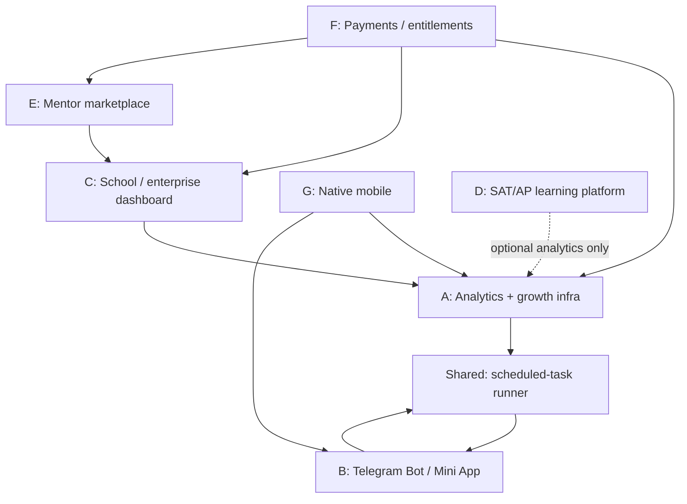

# UniWay Post-V1 Product Roadmap

Status: planning document, not a changelog. A module is only "shipped"
once its own acceptance criteria are met, its own tests pass, and it has
been verified in the browser/API against real (not fabricated) data —
per this task's own rule: a scaffold, empty page, model-only
implementation, or disabled button is not a completed feature, and must
not be reported as one.

This document is the execution plan for seven post-V1 modules. It is
long by necessity: each module needs enough detail that a future
session (or another engineer) can pick up any one of them without
re-deriving the whole platform's architecture from scratch.

## 0. How this fits the current platform

V1 (tag `v1.0.0`, see `docs/RELEASE_NOTES_V1.md`) already has: Django
REST Framework backend split into `services/*_service` apps, JWT auth
via `djangorestframework_simplejwt`, a single global `User.Role`
(student/organizer/admin), a Next.js (App Router) frontend with a
feature-sliced structure (`entities/`, `features/`, `screens/`), 4
locales, an AI gateway that calls Gemini directly over HTTP (no SDK
dependency, see `services/ai_gateway_service/`), a `Subscription`/
`Plan`/`UsageLimit`/`UsageLog` skeleton with no real billing behind it,
an in-app `Notification` model with per-category preferences but **no
background task runner of any kind** (no Celery, no APScheduler, no
cron — confirmed by search; `Notification.scheduled_for` is a schema
field with nothing currently reading it on a schedule), and hosting on
Render (backend, free tier, cold starts) + Vercel (frontend) +
Supabase/managed Postgres.

That missing scheduler is a real, load-bearing gap: any post-V1 feature
that needs "do X at time Y" (Telegram reminders, scheduled analytics
rollups, subscription renewal checks) needs this solved once, not once
per module. Module A (analytics) does not strictly need it; Module B
(Telegram) does. See the dependency graph below.

## 1. Dependency graph



Reasoning for each arrow:

- **A -> shared scheduler**: A's "weekly active users" / retention
  metrics are meaningless without a periodic rollup job; A is also the
  cheapest, lowest-risk place to build the scheduler for the first time.
- **B -> shared scheduler**: reminders (event/deadline/roadmap) are B's
  headline feature and cannot be built on an in-process timer (explicit
  task instruction, and correct: Render's free/starter dynos restart on
  deploys and can run multiple workers, so an in-process timer would
  fire zero times, once, or many times unpredictably).
- **C -> A**: an institution dashboard's "aggregate analytics" view is
  a read-only projection over the same event stream A defines; building
  A twice (once generic, once institution-scoped) would duplicate the
  entire event schema.
- **E -> C**: the mentor marketplace's moderation/reporting/audit-log
  patterns are the same shape as the institution dashboard's; C should
  ship first so E reuses its RBAC + audit-log primitives instead of
  inventing a second one.
- **F -> A, C, E**: entitlements need to know what a plan actually
  unlocks (AI messages, essay reviews, saved events already exist as
  limits; institution seats and mentor-marketplace access would be new
  limit types), so F's plan model needs C and E's shape decided first,
  even though F's own checkout/billing code is independent and can be
  built in parallel.
- **G -> A, B**: a mobile app's highest-value, lowest-cost first release
  is "the existing API + push notifications," which only makes sense
  once A's event pipeline (for a mobile-specific funnel) and B's
  reminder infrastructure (push notifications and Telegram reminders
  solve overlapping problems; building push before knowing whether
  Telegram reminders alone satisfy most users would be premature).
- **D (SAT/AP) has no hard dependency** on anything else — it is
  additive content + a new service app, self-contained, and only
  touches Analytics optionally (practice-session events).

## 2. Recommended implementation order

1. Analytics and observability foundation (Module A) -- includes the
   shared scheduled-task runner.
2. Telegram Bot / Mini App foundation (Module B).
3. School / enterprise dashboard MVP (Module C).
4. SAT/AP learning core (Module D) -- independent, can slot in anytime
   after A if engineering capacity allows; listed fourth only because
   A-C are more architecturally load-bearing for everything after them.
5. Mentor marketplace MVP (Module E).
6. Payments (Module F).
7. Native mobile application (Module G).

This matches the task's own suggested order. The one deviation worth
flagging: **D (SAT/AP) has been placed after C rather than immediately
after A**, because D has no dependents and no dependencies -- moving it
earlier or later only changes when its own value is delivered, not
whether anything else in this list is safe to build. Teams with spare
content-creation capacity (not engineering capacity) should start D's
content work in parallel with A-C's engineering, since writing good
original practice questions is a different skill and a different
bottleneck than backend/frontend engineering.

**Payments is deliberately sixth**, not first and not adjacent to any
single feature module, because it needs a stable plan/entitlement model
informed by what C and E actually gate (institution seats, mentor
sessions), a billing audit log, refund/cancellation rules, webhook
idempotency, and a legal/privacy review -- none of which exist yet and
none of which should be improvised under schedule pressure once a real
payment provider is wired up.

**Native mobile is deliberately last.** It duplicates zero business
logic (see Module G's own doc below) and only makes sense once the API
surface and mobile-responsive web flows it wraps are already stable;
building it earlier would mean rebuilding it every time A-F change
their contracts.

---

## Module A: Production analytics and growth infrastructure

### Product problem
There is currently no way to answer "how many students actually
complete onboarding," "which universities get saved but never turn
into applications," or "is the essay AI review feature used more than
once per student" without manually querying production. Product
decisions for every other module in this roadmap depend on knowing
current usage, not guessing it.

### Target users
Internal: founders/operators (via an internal dashboard, authorized
roles only). Indirectly, every other module benefits from the event
stream this creates.

### User stories
- As an operator, I want to see weekly active users and onboarding
  completion rate so I know whether the funnel is healthy.
- As an operator, I want to see save-to-application conversion per
  university so I can tell which catalog entries need better data.
- As an operator, I want error rate and endpoint latency visible in one
  place instead of grepping Render logs.

### Current backend support
None. No event-logging model, no aggregation job, no internal-only
API. `services/*_service/views.py` files already have per-endpoint
query-count regression tests (a useful existing convention to extend to
the new analytics-write path, so writing an event never becomes an
N+1).

### Current frontend support
None. The existing `AppShell`/nav structure and `AiRateLimit`/usage
display on the dashboard (`Free`, `MOCK SUBSCRIPTION`, `AI messages
used`, `Essay reviews used`) is the closest existing precedent for
"a small stats widget backed by a real count," and is the template to
follow for the internal dashboard's per-metric cards.

### Missing infrastructure
- An events table (or an app-specific one) is new.
- **The scheduled-task runner is new and shared**: recommend a Render
  **Cron Job** (a separate, tiny Render service type, billed
  separately, that runs `python manage.py rollup_analytics` on a fixed
  schedule) rather than an in-process scheduler or Celery+broker (which
  would need a new managed Redis/RabbitMQ instance -- avoid that cost
  and operational surface for a first version; revisit only if a true
  task queue with retries becomes necessary, e.g. for Module F's
  webhook processing).

### Data model
```python
class AnalyticsEvent(models.Model):
    class EventName(models.TextChoices):
        ACCOUNT_CREATED = "account_created", "Account created"
        ONBOARDING_STARTED = "onboarding_started", "Onboarding started"
        ONBOARDING_COMPLETED = "onboarding_completed", "Onboarding completed"
        UNIVERSITY_VIEWED = "university_viewed", "University viewed"
        UNIVERSITY_SAVED = "university_saved", "University saved"
        PROSPECTIVE_TARGET_CREATED = "prospective_target_created", "..."
        APPLICATION_CREATED = "application_created", "Application created"
        ESSAY_CREATED = "essay_created", "Essay created"
        ESSAY_REVIEW_REQUESTED = "essay_review_requested", "..."
        ESSAY_REVIEW_COMPLETED = "essay_review_completed", "..."
        ROADMAP_TASK_COMPLETED = "roadmap_task_completed", "..."
        EVENT_VIEWED = "event_viewed", "Event viewed"
        EVENT_REGISTERED = "event_registered", "Event registered"
        REPORT_SUBMITTED = "report_submitted", "Report submitted"
        DEMO_LOGIN_USED = "demo_login_used", "Demo login used"

    user = models.ForeignKey(AUTH_USER_MODEL, null=True, blank=True,
                              on_delete=models.SET_NULL)
    is_demo_account = models.BooleanField(default=False, db_index=True)
    event_name = models.CharField(max_length=40, choices=EventName.choices,
                                   db_index=True)
    # Small, schema-validated, non-identifying context only -- e.g.
    # {"university_id": 21}, never free text, never essay content.
    properties = models.JSONField(default=dict, blank=True)
    dedup_key = models.CharField(max_length=200, blank=True, db_index=True)
    created_at = models.DateTimeField(auto_now_add=True, db_index=True)

    class Meta:
        constraints = [
            models.UniqueConstraint(
                fields=["dedup_key"], condition=~Q(dedup_key=""),
                name="unique_analytics_event_dedup_key",
            )
        ]
        indexes = [models.Index(fields=["event_name", "created_at"])]


class AnalyticsDailyRollup(models.Model):
    """Written by the nightly Cron Job; the dashboard reads only this,
    never AnalyticsEvent directly, so the dashboard query cost is O(days
    shown) instead of O(events ever recorded)."""
    date = models.DateField(db_index=True)
    metric_name = models.CharField(max_length=60, db_index=True)
    value = models.DecimalField(max_digits=12, decimal_places=2)

    class Meta:
        constraints = [
            models.UniqueConstraint(fields=["date", "metric_name"],
                                     name="unique_rollup_per_day_metric")
        ]
```

### API requirements
- `POST /api/v1/analytics/events/` -- authenticated, rate-limited,
  accepts one event name + a small validated properties dict from a
  fixed per-event-name schema (reject unknown properties keys rather
  than silently storing them). Server sets `user`/`is_demo_account`
  from the authenticated session; the client never asserts its own
  user id.
- `GET /api/v1/admin/analytics/summary/` -- admin-only, reads
  `AnalyticsDailyRollup` for a date range, returns the metrics listed
  below.
- No endpoint ever returns raw per-user event rows to the frontend;
  the internal dashboard only ever sees aggregates.

### Security and privacy risks
- Event `properties` becoming a dumping ground for PII by accident
  (e.g. someone adds `{"query": user_search_string}` later). Mitigate
  with a strict per-event allow-listed properties schema enforced at
  the serializer, tested explicitly (a test that asserts an unknown
  key is rejected, not silently dropped -- silently dropping is worse
  because it hides the mistake).
- Demo-account traffic polluting real usage metrics. Mitigate with the
  `is_demo_account` flag, set from the same canonical-email check
  `common/demo_accounts.py` already uses, and excluded by default from
  every rollup metric.
- Essay text, draft content, or full URLs with query strings must never
  reach `properties` -- enforced by the allow-list, and by a test that
  POSTs a payload containing essay-shaped text and asserts rejection.

### Moderation requirements
None directly (this module has no user-generated content surface).

### Dependencies
None (first module in the recommended order).

### External credentials/services
None. No third-party analytics SaaS in this plan -- first-party only,
consistent with "privacy-conscious first-party."

### Estimated engineering complexity
Medium. ~1 model + 1 write endpoint + 1 rollup command + 1 admin-only
read endpoint + 1 internal dashboard screen. The Cron Job setup on
Render is an operational task, not code, but needs to be documented in
`docs/OPERATIONS.md` once configured.

### Acceptance criteria
- Posting each of the 15 listed events succeeds and is queryable via
  the admin summary endpoint the next day (post-rollup).
- A non-admin user gets 403 on the summary endpoint.
- A payload with an unsupported property key is rejected with 400, not
  silently accepted.
- Demo-account events are excluded from every rollup metric by default.
- The write endpoint's query count does not grow with unrelated table
  sizes (query-count regression test, matching existing convention).

### Tests
Serializer validation (allow-list enforcement, unknown key rejection),
dedup-key uniqueness, rollup command correctness (given fixed sample
events, assert the resulting rollup rows), permission checks on the
summary endpoint, demo-account exclusion.

### Deployment strategy
Standard migration + deploy. Cron Job is a separate Render resource
created once, pointed at `python manage.py rollup_analytics`, documented
in `docs/OPERATIONS.md` with its schedule.

### Rollback strategy
Feature is additive (new app, new endpoints); rollback is reverting the
deploy. No existing endpoint's behavior changes, so no user-facing
regression risk from rollback.

### Measurable success metrics
Onboarding completion %, activation (creates >=1 application or essay
within 7 days of account creation), WAU, week-over-week return rate,
university-view-to-save conversion, save-to-application conversion,
essay-review completion rate, roadmap task completion rate, event-view-
to-registration conversion, 5xx error rate, p50/p95 endpoint latency
(the latter already partially covered by existing performance-audit
docs; this module makes it a live dashboard instead of a point-in-time
audit).

### Explicit non-goals
No third-party analytics vendor integration. No session replay or
heatmaps. No per-user event browsing UI (aggregates only). No A/B
testing framework (a later, separate decision).

---

## Module B: Telegram Bot and Mini App

### Product problem
Students already provide a `telegram_username` in their profile
(`user_profile_service` -- see `populate_demo_student_profile`'s
`telegram_username` field), but nothing is done with it. Deadline and
event reminders currently rely on the student opening the web app.

### Target users
Students (primary), organizers (secondary -- notified about their own
events' registration activity, if permission allows).

### User stories
- As a student, I want to link my Telegram account so I can get a
  reminder before an application deadline without opening the website.
- As a student, I want to unlink Telegram at any time.
- As a student, I want to browse and register for events inside
  Telegram without leaving the app (Mini App), for the events I'd
  otherwise browse on `/events`.

### Current backend support
`UserProfile.telegram_username` exists as a free-text field (not
verified, not linked to a real Telegram account -- just a string the
student typed in). `Notification`/`NotificationPreference` already
model per-category opt-in/out and a `related_entity_type` /
`related_entity_id` pointer, which is the right shape to attach a
Telegram delivery record to.

### Current frontend support
None beyond the profile's plain-text field.

### Missing infrastructure
- Telegram account linking (verified, not just a typed username).
- A bot token + webhook endpoint (external credential -- see below).
- The shared scheduled-task runner (Module A's Cron Job) for reminder
  dispatch -- Telegram reminders are the first real consumer of it.

### Data model
```python
class TelegramLink(models.Model):
    user = models.OneToOneField(AUTH_USER_MODEL, on_delete=models.CASCADE,
                                 related_name="telegram_link")
    telegram_user_id = models.BigIntegerField(unique=True, db_index=True)
    telegram_username = models.CharField(max_length=64, blank=True)
    linked_at = models.DateTimeField(auto_now_add=True)
    unlinked_at = models.DateTimeField(null=True, blank=True)

    class Meta:
        constraints = [
            models.UniqueConstraint(
                fields=["telegram_user_id"], condition=Q(unlinked_at__isnull=True),
                name="unique_active_telegram_user_id",
            )
        ]


class TelegramLinkToken(models.Model):
    """Short-lived, single-use token shown in the web app; the student
    sends it to the bot to complete linking, so the bot never has to
    trust a Telegram-supplied user id without a server-issued token in
    between."""
    user = models.ForeignKey(AUTH_USER_MODEL, on_delete=models.CASCADE)
    token = models.CharField(max_length=64, unique=True)
    expires_at = models.DateTimeField()
    consumed_at = models.DateTimeField(null=True, blank=True)


class ReminderDelivery(models.Model):
    """One row per reminder actually sent, so the Cron Job's periodic
    scan is naturally idempotent (never re-sends a reminder already
    recorded here) without needing external dedup."""
    user = models.ForeignKey(AUTH_USER_MODEL, on_delete=models.CASCADE)
    channel = models.CharField(max_length=20, choices=[("telegram", "Telegram")])
    related_entity_type = models.CharField(max_length=40)
    related_entity_id = models.PositiveIntegerField()
    sent_at = models.DateTimeField(auto_now_add=True)

    class Meta:
        constraints = [
            models.UniqueConstraint(
                fields=["user", "channel", "related_entity_type", "related_entity_id"],
                name="unique_reminder_per_entity_per_channel",
            )
        ]
```

### API requirements
- `POST /api/v1/telegram/link-token/` -- authenticated; issues a
  `TelegramLinkToken` (short expiry, e.g. 10 minutes), returned to the
  student to paste into the bot chat.
- Telegram webhook endpoint (`POST /api/v1/telegram/webhook/`) --
  receives bot updates; verifies the request is genuinely from
  Telegram (secret path token or `X-Telegram-Bot-Api-Secret-Token`
  header, per Telegram's own webhook-security recommendation), looks
  up the token the student sent, marks it consumed, creates
  `TelegramLink`.
- `DELETE /api/v1/telegram/link/` -- authenticated; sets `unlinked_at`,
  does not delete the row (audit trail), same "revoke, don't destroy"
  pattern already used for demo-account deactivation.
- Mini App auth: Telegram's own `initData` signed payload, verified
  server-side against the bot token's HMAC (never trust an unsigned
  Telegram user id from the frontend), with an explicit expiration
  check (`auth_date` must be recent) and single-use nonce or short
  server-side session to prevent replay.

### Security and privacy risks
- **Trusting an unverified Telegram user id** -- the single biggest risk
  in this module. Mitigated by requiring the *student's own web
  session* to request a link token first (proves web-session
  ownership), and by verifying `initData`'s HMAC signature server-side
  for every Mini App request (proves Telegram-session ownership).
  Neither alone is sufficient; both together prevent "attacker links
  their own Telegram to a victim's account" and "attacker forges
  Telegram identity in the Mini App."
- **Replay of an old, valid `initData` payload.** Mitigated by checking
  `auth_date` is within a short window (Telegram's own guidance is a
  few minutes) and rejecting stale payloads.
- **Cross-user account linking** (token intercepted, replayed against a
  different account). Mitigated by single-use consumption
  (`consumed_at`) and short expiry.
- **Rate-limiting link attempts** to prevent token brute-forcing (tokens
  should be cryptographically random and long enough that brute-force
  is infeasible regardless, but rate-limit the webhook endpoint too).

### Moderation requirements
Student-only safe commands (no organizer/admin actions exposed through
the bot). No open free-text relay between students through the bot.

### Dependencies
Module A's Cron Job (or an equivalent minimal scheduler) for reminder
dispatch.

### External credentials/services
**A Telegram bot token, obtained from @BotFather, is required for any
live behavior.** This cannot be obtained by an engineering session --
it requires a human to create the bot in Telegram and hand over the
token as a Render environment variable (`TELEGRAM_BOT_TOKEN`), plus a
publicly reachable HTTPS webhook URL (Render already provides this).
**If this credential is unavailable:** implement the full data model,
serializers, views, webhook signature verification, tests (using a
stubbed/fake Telegram payload, not a live bot), and documentation;
leave the feature behind a `TELEGRAM_BOT_TOKEN`-presence check that
disables the link-token endpoint with a clear "Telegram is not
configured yet" response instead of a crash; report the exact
environment variable name needed (`TELEGRAM_BOT_TOKEN`, and the webhook
URL to register with @BotFather) without ever printing a real value;
do not claim a live Telegram E2E test happened if it did not.

### Estimated engineering complexity
Medium-high. The account-linking security model needs care; the Mini
App shell can reuse existing frontend components (event list, My
Events) behind a Telegram-specific auth adapter rather than a
duplicate UI.

### Acceptance criteria
- A student can request a link token, send it to the bot (or, in the
  disabled-credential state, receives a clear "not configured" error),
  and see their account marked linked.
- Unlinking sets `unlinked_at` and immediately stops reminder dispatch
  to that user, verified by a test.
- A forged/expired `initData` payload is rejected with 401, verified by
  a test using a deliberately stale/invalid signature.
- A reminder for the same entity is never sent twice, verified by a
  test that runs the dispatch command twice.

### Tests
Link-token issuance and expiry, webhook signature verification
(valid/invalid/expired), `initData` HMAC verification (valid/invalid/
stale), unlink stops future reminders, reminder dedup via
`ReminderDelivery`'s unique constraint, rate-limiting on the webhook
and link-token endpoints.

### Deployment strategy
Ship the full linking + Mini App auth + reminder-dispatch code behind
the credential-presence check first (safe to deploy with
`TELEGRAM_BOT_TOKEN` unset -- feature simply stays disabled). Only
register the live webhook with @BotFather once the credential exists
and the code has been verified against a real bot in a controlled test.

### Rollback strategy
Unset `TELEGRAM_BOT_TOKEN` (or revert the deploy) to disable instantly;
no destructive migration involved. `TelegramLink`/`ReminderDelivery`
rows are harmless to leave in place if rolled back.

### Measurable success metrics
% of active students who link Telegram, reminder-driven return-visit
rate (a student who got a reminder returns to the app within 24h),
Mini App weekly active users as a fraction of total WAU.

### Explicit non-goals
No general-purpose chatbot/AI assistant inside Telegram. No free-text
messaging between users via the bot. No payments inside Telegram for
V1 of this module.

---

## Module C: School and enterprise dashboard

### Product problem
Counselors and school administrators currently have no way to see
their students' application/deadline/profile progress in aggregate;
every student's data is only visible to that one student.

### Target users
School counselors/advisors, school administrators, (future)
organization managers overseeing counselors.

### User stories
- As a counselor, I want to see my assigned students' application
  pipeline at a glance so I know who needs help before a deadline.
- As a school manager, I want to invite counselors and see aggregate,
  non-identifying progress metrics across the whole school.
- As a student, I want to control whether my counselor can see my
  essays, not just my application status.

### Current backend support
None. `User.Role` has no institution-scoped role today (see the note in
section 0). Existing patterns to reuse: the admin feedback-inbox
permission pattern (`feedback_service`) for "staff-like role sees
cross-user data safely," and the audit-log style already used for demo
account deactivation (never delete, always record a status change).

### Current frontend support
None.

### Missing infrastructure
Multi-tenant data model (new), RBAC distinct from the existing global
`User.Role` (new, additive -- see design note below), CSV export
(new), audit log (new, though the *pattern* already exists elsewhere).

### Data model
```python
class Institution(models.Model):
    name = models.CharField(max_length=240)
    slug = models.SlugField(unique=True)
    country = models.CharField(max_length=100, blank=True)
    is_active = models.BooleanField(default=True)
    created_at = models.DateTimeField(auto_now_add=True)


class InstitutionMembership(models.Model):
    """Deliberately separate from User.Role: a user's platform-level
    role (student/organizer/admin) is unrelated to their relationship
    to a specific institution. This is additive -- it does not touch
    the existing User model or any existing permission class."""
    class MemberRole(models.TextChoices):
        STUDENT_MEMBER = "student_member", "Student"
        COUNSELOR = "counselor", "Counselor / advisor"
        SCHOOL_MANAGER = "school_manager", "School manager"
        ORG_MANAGER = "org_manager", "Organization manager"

    institution = models.ForeignKey(Institution, on_delete=models.CASCADE,
                                     related_name="memberships")
    user = models.ForeignKey(AUTH_USER_MODEL, on_delete=models.CASCADE,
                              related_name="institution_memberships")
    role = models.CharField(max_length=20, choices=MemberRole.choices)
    invited_by = models.ForeignKey(AUTH_USER_MODEL, null=True, blank=True,
                                    on_delete=models.SET_NULL,
                                    related_name="+")
    status = models.CharField(
        max_length=20,
        choices=[("invited", "Invited"), ("active", "Active"),
                 ("removed", "Removed"), ("suspended", "Suspended")],
        default="invited",
    )
    # Explicit, per-student, revocable consent -- a counselor sees only
    # what a student has actively agreed to share, never essays by
    # default.
    shares_application_status = models.BooleanField(default=False)
    shares_essays = models.BooleanField(default=False)
    joined_at = models.DateTimeField(null=True, blank=True)
    removed_at = models.DateTimeField(null=True, blank=True)

    class Meta:
        constraints = [
            models.UniqueConstraint(
                fields=["institution", "user"],
                condition=Q(status__in=["invited", "active"]),
                name="unique_active_membership_per_institution",
            )
        ]


class InstitutionAuditLogEntry(models.Model):
    institution = models.ForeignKey(Institution, on_delete=models.CASCADE)
    actor = models.ForeignKey(AUTH_USER_MODEL, on_delete=models.SET_NULL, null=True)
    action = models.CharField(max_length=60)
    target_user = models.ForeignKey(AUTH_USER_MODEL, on_delete=models.SET_NULL,
                                     null=True, related_name="+")
    metadata = models.JSONField(default=dict, blank=True)
    created_at = models.DateTimeField(auto_now_add=True)
```

### API requirements
- Invitation flow: `POST /api/v1/institutions/{slug}/invitations/`
  (school_manager/org_manager only) -- creates an `invited`
  `InstitutionMembership`, sends an in-app `Notification` (reuses
  Module A's/existing notification plumbing, not a new channel).
- `POST /api/v1/institutions/invitations/{id}/accept/` -- the invited
  user (student or counselor) accepts, `status` becomes `active`.
- `GET /api/v1/institutions/{slug}/students/` -- counselor/school_manager
  only, returns each consenting student's application/deadline summary
  **filtered server-side by `shares_application_status`/
  `shares_essays`** -- a student who has not consented never appears
  with more than their name and institution-membership status.
- `GET /api/v1/institutions/{slug}/analytics/` -- aggregate only (reuses
  Module A's rollup pattern, scoped to the institution's member ids).
- `GET /api/v1/institutions/{slug}/students/export/` -- CSV, excludes
  essay text and any field the student has not consented to share,
  school_manager only, writes an `InstitutionAuditLogEntry`.
- Every one of the above writes or reads institution-scoped data
  through a single shared permission class
  (`IsActiveInstitutionMember`/`IsInstitutionManager`) that checks
  `InstitutionMembership` -- never through `User.Role`, so there is no
  way to accidentally leak institution data through an existing
  global-role check.

### Security and privacy risks
- **The core risk of this entire module: a counselor seeing a
  student's private data without consent.** Mitigated structurally (the
  API filters by the consent booleans server-side, not the frontend)
  and by a dedicated test suite that creates a non-consenting student
  and asserts their essays/application detail never appear in any
  counselor-facing endpoint.
- **Cross-school data leakage** (a counselor at School A querying School
  B's students). Mitigated by every institution-scoped endpoint
  filtering by the `{slug}` in the URL *and* re-checking the
  requesting user's own active membership in that exact institution
  (never trust the URL slug alone).
- **No global student search** -- there is no endpoint that lists
  students across institutions; every list endpoint requires an
  institution context and active membership in it.
- Exports must exclude essay text and any non-consented field by
  construction (same filter as the list endpoint), not by a separate,
  divergent export-specific field list that could drift out of sync.
- Every sensitive access (viewing a student list, exporting) writes an
  `InstitutionAuditLogEntry`.

### Moderation requirements
`school_manager`/`org_manager` can suspend or remove a counselor
membership (sets `status`, never deletes the row). A removed
counselor's access to that institution's students stops immediately
(enforced by the permission class checking `status == "active"`, not
just membership existence).

### Dependencies
None hard; benefits from Module A's rollup pattern for its own
aggregate-analytics endpoint (reuse, not a blocking dependency).

### External credentials/services
None.

### Estimated engineering complexity
High. This is the largest data-modeling and permission-design effort
in the roadmap after Payments, because of the consent-gating
requirement threaded through every endpoint.

### Acceptance criteria
- A school_manager can invite a counselor and a student; both can
  accept.
- A counselor sees a student's application status only after that
  student sets `shares_application_status=True`; before that, the
  counselor sees the student's name and membership status only.
- A counselor from Institution A gets 403/404 (not data) when querying
  Institution B's student list, even with a guessed valid slug.
- CSV export never contains essay text, verified by a test that seeds
  an essay and asserts it is absent from the exported bytes.
- Every list/export access creates exactly one audit log entry.

### Tests
Invitation/accept flow, consent-gated field visibility (both directions
-- with and without consent), cross-institution access denial, removed-
membership access denial, export content exclusion, audit log entry
creation on every sensitive read.

### Deployment strategy
New app (`services/institution_service`), additive migrations, no
existing endpoint changes. Ship with feature-flagged navigation entry
(hidden unless the requesting user has at least one active
`InstitutionMembership`) so it is invisible to the existing student/
organizer/admin population until institutions are actually onboarded.

### Rollback strategy
Additive-only; revert the deploy. No existing table altered.

### Measurable success metrics
Institutions onboarded, counselor activation (>=1 student list view
within 7 days of accepting), student consent rate (% of institution-
linked students who enable at least `shares_application_status`),
counselor-viewed students' application completion rate vs. platform
baseline (does having a counselor correlate with better outcomes --
directional signal, not causal claim).

### Explicit non-goals
No parent/guardian accounts in this MVP. No grading or curriculum
tools. No cross-institution comparison/benchmarking dashboards. No
automatic content sharing -- every share is opt-in per student.

---

## Module D: SAT/AP learning-platform core

### Product problem
`exam_content_service` already exists with a real, if minimal, schema
(`Exam`, `ExamSection`, `Question`, `AnswerChoice`, `Explanation` --
see `seed_demo.py`'s `seed_question`) and one demonstration SAT-style
arithmetic question. There is no real content, no progress tracking,
and no study-plan/mastery model.

### Target users
Students preparing for SAT/AP exams (already a stated intent in the
profile's `exam_plans`/`preparation_needs` fields).

### User stories
- As a student, I want to practice original SAT Math questions and see
  which skills I am weak on.
- As a student, I want a bookmark list of questions to revisit.
- As a student, I want timed practice that mirrors real exam pacing.

### Current backend support
`exam_content_service` models already exist:
`Exam`/`ExamSection`/`Question`/`AnswerChoice`/`Explanation`, with an
`origin`/`provenance_note` pair on `Question` (already tracks
"original" vs. other provenance -- reuse this, do not invent a second
provenance field). No progress, mastery, study-plan, or bookmark
models exist yet.

### Current frontend support
`/exams` screen exists as a preview/placeholder per V1's known
limitations (`docs/V1_HANDOFF.md`: "SAT/IELTS/AP banks are not
production-ready").

### Missing infrastructure
Progress/mastery tracking, study-plan generation, bookmarks, timed
practice sessions, content moderation workflow (draft/reviewed/
published/archived) on top of the existing `is_published` boolean.

### Data model
```python
class Skill(models.Model):
    section = models.ForeignKey(ExamSection, on_delete=models.CASCADE,
                                 related_name="skills")
    name = models.CharField(max_length=120)
    slug = models.SlugField()


# Add to the existing Question model (migration, not a new model):
#   skill = models.ForeignKey(Skill, null=True, blank=True, ...)
#   review_status = models.CharField(
#       choices=[("draft","Draft"),("reviewed","Reviewed"),
#                ("published","Published"),("archived","Archived")],
#       default="draft")
#   difficulty = models.CharField(choices=[("easy",...),("medium",...),("hard",...)])
# `is_published` stays as the existing student-visibility gate;
# `review_status` is the new internal content-QA workflow leading up to it.

class PracticeSession(models.Model):
    user = models.ForeignKey(AUTH_USER_MODEL, on_delete=models.CASCADE)
    exam = models.ForeignKey(Exam, on_delete=models.CASCADE)
    started_at = models.DateTimeField(auto_now_add=True)
    completed_at = models.DateTimeField(null=True, blank=True)
    is_timed = models.BooleanField(default=False)
    time_limit_seconds = models.PositiveIntegerField(null=True, blank=True)


class PracticeAnswer(models.Model):
    session = models.ForeignKey(PracticeSession, on_delete=models.CASCADE,
                                 related_name="answers")
    question = models.ForeignKey(Question, on_delete=models.CASCADE)
    chosen_choice = models.ForeignKey(AnswerChoice, on_delete=models.SET_NULL, null=True)
    is_correct = models.BooleanField()
    answered_at = models.DateTimeField(auto_now_add=True)


class SkillMastery(models.Model):
    """Simple, transparent formula only -- no black-box scoring, matching
    this codebase's existing "no fake predictions" ethos."""
    user = models.ForeignKey(AUTH_USER_MODEL, on_delete=models.CASCADE)
    skill = models.ForeignKey(Skill, on_delete=models.CASCADE)
    correct_count = models.PositiveIntegerField(default=0)
    attempt_count = models.PositiveIntegerField(default=0)
    updated_at = models.DateTimeField(auto_now=True)

    class Meta:
        constraints = [models.UniqueConstraint(fields=["user", "skill"],
                                                name="unique_mastery_per_skill")]


class QuestionBookmark(models.Model):
    user = models.ForeignKey(AUTH_USER_MODEL, on_delete=models.CASCADE)
    question = models.ForeignKey(Question, on_delete=models.CASCADE)
    created_at = models.DateTimeField(auto_now_add=True)

    class Meta:
        constraints = [models.UniqueConstraint(fields=["user", "question"],
                                                name="unique_bookmark")]
```

### API requirements
`GET /api/v1/exams/{slug}/questions/` (published + reviewed only for
students; staff can see all `review_status` values), `POST
/api/v1/exams/practice-sessions/` (start), `POST
/api/v1/exams/practice-sessions/{id}/answer/`, `POST
/api/v1/exams/practice-sessions/{id}/complete/`, `GET
/api/v1/exams/mastery/` (per-skill breakdown for the requesting user
only), bookmark create/delete.

### Security and privacy risks
Low relative to other modules -- no cross-user data exposure by design
(mastery/sessions/bookmarks are always scoped to `request.user`). Main
risk is a student seeing `draft`/`archived` content if the
`review_status` filter is forgotten on the public question-list
endpoint -- covered by an explicit test.

### Moderation requirements
`review_status` workflow (draft -> reviewed -> published, or ->
archived at any point) gated to staff; a dedicated internal review
queue screen (reuses the existing admin-moderation UI pattern from
`admin-moderation`/event moderation, not a new one).

### Dependencies
None.

### External credentials/services
None.

### Estimated engineering complexity
Medium for the engineering (mostly additive models + straightforward
CRUD); the real bottleneck is **content**, not code.

### Acceptance criteria
- A student can complete a timed practice session and see per-skill
  mastery update afterward.
- A `draft` or `archived` question never appears in the student-facing
  question list, verified by a test.
- Bookmarking is idempotent (bookmarking twice does not error or
  duplicate).
- At least the five listed starter subjects have >=1 published,
  reviewed, original question each before this module is reported as
  "content available" (a handful of seed questions is not "SAT/AP bank
  available" and must not be reported as such).

### Tests
Session start/answer/complete flow, mastery calculation correctness,
review-status visibility filter, bookmark idempotency, provenance field
required to be `original` (or a licensed/public-domain value) for
anything reachable by the public endpoint -- a test that asserts no
question with an unset/unknown `origin` is ever published.

### Deployment strategy
Additive migration to `exam_content_service`. Ship content behind
`review_status="draft"` by default; a separate, explicit content-review
pass (human, not automated) promotes to `published`.

### Rollback strategy
Additive-only; revert the deploy. Existing `/exams` preview page
behavior is unaffected until the new UI is wired in.

### Measurable success metrics
Practice sessions started/completed, questions answered per active
user per week, per-skill mastery improvement over time, bookmark usage
rate.

### Explicit non-goals
No copied or scraped question banks from any existing test-prep
company. No claim of official College Board affiliation or
endorsement, anywhere in copy. No adaptive/AI-driven question selection
in this first version (skill-gap-based static selection only, to keep
the model transparent and avoid another "no fake predictions" boundary
to police).

---

## Module E: Mentor marketplace

### Product problem
Students have no structured way to get matched with a mentor for
guidance; any ad hoc solution risks being the least safe module in this
roadmap given a plausibly-minor user base.

### Target users
Students (mentees), verified mentors (could be alumni, professionals,
or upperclassmen -- verification process TBD by product/legal, not
engineering).

### User stories
- As a student, I want to request a session with a mentor in a relevant
  field.
- As a mentor, I want to accept or decline session requests and see my
  upcoming schedule.
- As a student or mentor, I want to report inappropriate behavior and
  know it will be reviewed.

### Current backend support
None directly. Reusable patterns: `feedback_service`'s
`FeedbackReport` model/admin-inbox is the direct template for this
module's reporting flow (same shape: category, detail, target
validation, admin review). `ApplicationRecommendation`'s
request/accept/decline lifecycle (`application_service`) is the
direct template for session request/accept/decline states.

### Current frontend support
None.

### Missing infrastructure
Mentor verification/profile, availability, session request lifecycle,
blocking, moderation queue (new instance of an existing pattern, not a
new pattern).

### Data model
```python
class MentorProfile(models.Model):
    user = models.OneToOneField(AUTH_USER_MODEL, on_delete=models.CASCADE)
    is_verified = models.BooleanField(default=False)
    bio = models.TextField(max_length=2000, blank=True)
    expertise_areas = models.JSONField(default=list, blank=True)
    languages = models.JSONField(default=list, blank=True)
    is_accepting_requests = models.BooleanField(default=True)
    verified_at = models.DateTimeField(null=True, blank=True)
    verified_by = models.ForeignKey(AUTH_USER_MODEL, null=True, blank=True,
                                     on_delete=models.SET_NULL, related_name="+")


class MentorAvailabilitySlot(models.Model):
    mentor = models.ForeignKey(MentorProfile, on_delete=models.CASCADE,
                                related_name="availability_slots")
    starts_at = models.DateTimeField()
    ends_at = models.DateTimeField()
    is_booked = models.BooleanField(default=False)


class MentorshipSession(models.Model):
    class Status(models.TextChoices):
        REQUESTED = "requested", "Requested"
        ACCEPTED = "accepted", "Accepted"
        DECLINED = "declined", "Declined"
        CANCELLED = "cancelled", "Cancelled"
        COMPLETED = "completed", "Completed"

    mentor = models.ForeignKey(MentorProfile, on_delete=models.CASCADE,
                                related_name="sessions")
    student = models.ForeignKey(AUTH_USER_MODEL, on_delete=models.CASCADE,
                                 related_name="mentorship_sessions")
    slot = models.ForeignKey(MentorAvailabilitySlot, on_delete=models.SET_NULL, null=True)
    status = models.CharField(max_length=20, choices=Status.choices,
                               default=Status.REQUESTED)
    topic = models.CharField(max_length=200, blank=True)
    requested_at = models.DateTimeField(auto_now_add=True)
    responded_at = models.DateTimeField(null=True, blank=True)


class MentorBlock(models.Model):
    """Either party can block the other; a block is bidirectional in
    effect (neither can request/be requested by the other again)."""
    blocker = models.ForeignKey(AUTH_USER_MODEL, on_delete=models.CASCADE,
                                 related_name="blocks_made")
    blocked = models.ForeignKey(AUTH_USER_MODEL, on_delete=models.CASCADE,
                                 related_name="blocks_received")
    created_at = models.DateTimeField(auto_now_add=True)

    class Meta:
        constraints = [models.UniqueConstraint(fields=["blocker", "blocked"],
                                                name="unique_block_pair")]

# MentorshipReport reuses feedback_service.FeedbackReport's exact shape
# (target_type="mentorship_session", target_id) rather than a new model.
```

### API requirements
Mentor profile CRUD (mentor only, `is_verified` set only by admin),
availability slot CRUD, session request/accept/decline/cancel/complete
(state-machine enforced server-side -- e.g. only `REQUESTED` can become
`ACCEPTED`/`DECLINED`), block create (immediately hides both parties
from each other's request/browse views), report submission (delegates
to the existing `feedback_service` endpoint with a new target type).

### Security and privacy risks
- **The dominant risk given a likely-minor user base: unsafe off-
  platform contact.** Mitigate by never exposing either party's email/
  phone/external handles through this module's API (session
  coordination stays in-app; if a video-call link is needed later, it
  is generated per-session, not a persistent personal contact
  exchange).
- **Grooming/inappropriate-contact risk.** Mitigate with mandatory
  reporting (visible on every session), blocking, and an explicit
  conduct policy shown before a student's first request. `is_verified`
  gating (product/legal decides the verification process; engineering
  only enforces that unverified mentors cannot appear in student-facing
  browse/search) is a structural mitigation, not a complete one --
  this module should launch with a conservative, small, hand-reviewed
  mentor pool, not open self-serve mentor signup.
- **Blocked-user bypass** (blocked mentor creates a new session request
  before the student notices). Mitigate by checking `MentorBlock` in
  both directions on every request-creation call, tested explicitly.

### Moderation requirements
Every `MentorshipReport` lands in the same admin inbox pattern as
`feedback_service`'s existing one (reuse the UI, add a target-type
filter). Admin can suspend a `MentorProfile` (`is_accepting_requests =
False` plus a suspension flag), which must take effect immediately for
new requests but not retroactively cancel already-accepted sessions
(a separate admin action, not automatic).

### Dependencies
Module C's RBAC/audit-log primitives (reuse pattern, not a hard
blocker) -- this module can technically ship without Module C, but
should follow whatever conventions Module C establishes for
consistency.

### External credentials/services
None required for the MVP (in-app text-based coordination only; no
video/calendar-provider integration in this version).

### Estimated engineering complexity
Medium-high, mostly because of the safety-review burden (product +
legal sign-off on the mentor-verification process is a prerequisite to
launch, not an engineering task, and should not be treated as
optional).

### Acceptance criteria
- A student cannot request a session with an unverified mentor (the
  mentor never appears in the browse/search results).
- A blocked pair cannot create new session requests in either
  direction, verified by a test.
- Session status transitions are enforced server-side (e.g. `POST
  .../accept/` on an already-`DECLINED` session returns 409, not a
  silently-accepted state change).
- A report against a session reaches the existing admin feedback inbox
  with the correct target type.
- No endpoint in this module ever returns another user's email/phone
  in the response body.

### Tests
Verification-gated visibility, block bypass prevention (both
directions), state-machine transition enforcement (every invalid
transition explicitly tested, not just the happy path), report routing
to the shared inbox, no-contact-info-leak assertion on every serializer
in this module.

### Deployment strategy
Ship fully feature-flagged and invisible in navigation until a
hand-reviewed initial mentor cohort exists; do not open self-serve
mentor signup at launch.

### Rollback strategy
Additive-only; revert the deploy. `MentorshipSession` rows are
harmless to leave in place.

### Measurable success metrics
Verified mentors onboarded, session request-to-accept rate, session
completion rate, reports-per-100-sessions (a rising trend is a launch-
pausing signal, not just a metric to watch passively).

### Explicit non-goals
No payments for mentor sessions in this MVP (see Module F's explicit
ordering -- payments come after this module's safety foundation, not
alongside it). No open self-serve mentor signup at launch. No video-
calling infrastructure built in-house (use a per-session external link
if needed, not a WebRTC build-out).

---

## Module F: Payments and subscriptions

### Product problem
`Subscription`/`Plan`/`UsageLimit` already exist and are enforced for
AI messages/essay reviews/saved events, but every user is effectively
on `Plan.FREE` with no way to actually upgrade -- the pricing page
already says "Plans coming soon."

### Target users
Students (and, later, institutions via Module C seats) who want a paid
tier.

### User stories
- As a student, I want to upgrade to a paid plan and immediately get
  the higher usage limits.
- As a student, I want to cancel and know exactly when access ends.
- As an operator, I want a billing audit log so a support question
  ("why was I charged twice") is always answerable from data, not
  memory.

### Current backend support
`Subscription` (plan, usage counters), `UsageLimit` (per-plan caps,
`feature_flags` JSON), `UsageLog` -- a genuinely useful foundation.
Nothing enforces a *real* upgrade path; `Subscription.plan` can already
be set programmatically (as `seed_demo.py` does), but there is no
checkout, no payment provider, no webhook handling, no refund/
cancellation state.

### Current frontend support
`/pricing` page exists showing "Plans coming soon" (per
`docs/V1_HANDOFF.md`).

### Missing infrastructure
Everything described in the task's own explicit prerequisite list:
plan/entitlement model beyond the current simple `Plan` enum, billing
audit log, refund/cancellation rules, webhook idempotency, legal/
privacy review. **None of this should be skipped under schedule
pressure** -- this is the one module in the roadmap where getting the
architecture right before touching money matters more than shipping
fast.

### Data model
```python
# Extend, do not replace, the existing Subscription model.
class BillingCustomer(models.Model):
    user = models.OneToOneField(AUTH_USER_MODEL, on_delete=models.CASCADE)
    provider = models.CharField(max_length=30)  # e.g. "stripe"
    provider_customer_id = models.CharField(max_length=100, unique=True)


class BillingRecord(models.Model):
    class Status(models.TextChoices):
        PENDING = "pending", "Pending"
        SUCCEEDED = "succeeded", "Succeeded"
        FAILED = "failed", "Failed"
        REFUNDED = "refunded", "Refunded"

    user = models.ForeignKey(AUTH_USER_MODEL, on_delete=models.CASCADE)
    provider = models.CharField(max_length=30)
    provider_invoice_id = models.CharField(max_length=100, unique=True)
    amount = models.DecimalField(max_digits=10, decimal_places=2)
    currency = models.CharField(max_length=3)
    status = models.CharField(max_length=20, choices=Status.choices)
    plan = models.CharField(max_length=20, choices=Plan.choices)
    created_at = models.DateTimeField(auto_now_add=True)


class WebhookEvent(models.Model):
    """Every inbound webhook is recorded before processing, keyed by the
    provider's own event id, so a retried webhook delivery (which every
    real provider does) is a no-op the second time -- this is the
    idempotency mechanism, not a side effect of it."""
    provider = models.CharField(max_length=30)
    provider_event_id = models.CharField(max_length=120)
    event_type = models.CharField(max_length=60)
    payload = models.JSONField()
    processed_at = models.DateTimeField(null=True, blank=True)
    created_at = models.DateTimeField(auto_now_add=True)

    class Meta:
        constraints = [models.UniqueConstraint(
            fields=["provider", "provider_event_id"],
            name="unique_webhook_event_per_provider")]


class SubscriptionCancellation(models.Model):
    subscription = models.ForeignKey(Subscription, on_delete=models.CASCADE)
    requested_at = models.DateTimeField(auto_now_add=True)
    effective_at = models.DateTimeField()  # end of paid period, not immediate
    reason = models.CharField(max_length=200, blank=True)


class BillingAuditLogEntry(models.Model):
    actor = models.ForeignKey(AUTH_USER_MODEL, null=True, on_delete=models.SET_NULL)
    action = models.CharField(max_length=60)
    target_user = models.ForeignKey(AUTH_USER_MODEL, on_delete=models.SET_NULL,
                                     null=True, related_name="+")
    metadata = models.JSONField(default=dict, blank=True)
    created_at = models.DateTimeField(auto_now_add=True)
```

### API requirements
`POST /api/v1/billing/checkout-session/` -- creates a **hosted
checkout session** with the provider (Stripe Checkout or equivalent;
never a custom card form -- see security note), returns a redirect
URL. `POST /api/v1/billing/webhook/` -- provider webhook receiver,
verifies the provider's signature, writes `WebhookEvent` first,
processes idempotently, updates `Subscription`/`BillingRecord`. `POST
/api/v1/billing/cancel/` -- creates a `SubscriptionCancellation` with
`effective_at` at the end of the current paid period, not immediate
downgrade. `GET /api/v1/billing/history/` -- the user's own
`BillingRecord`s.

### Security and privacy risks
- **Never handle raw card data.** Use the provider's hosted checkout
  page exclusively; the backend never sees a card number.
- **Webhook signature verification is mandatory**, not optional --
  every webhook handler must reject an unsigned or badly-signed
  payload before touching `WebhookEvent`.
- **Duplicate fulfillment from a retried webhook.** Prevented by the
  `WebhookEvent` unique constraint on `(provider, provider_event_id)`
  checked before any side effect.
- **Sandbox/production credential separation** -- provider API keys are
  environment-specific (test vs. live mode), never hard-coded, and the
  live key is never present in a non-production environment.
- Provider secrets are backend-only, exactly like the existing rule for
  the Gemini API key (`AI_GEMINI_API_KEY`-style: never a
  `NEXT_PUBLIC_`-prefixed variable).

### Moderation requirements
None directly (no user-generated content), but `BillingAuditLogEntry`
must be written for every plan change, cancellation, and refund so
support/legal always has a full trail.

### Dependencies
A stable plan/entitlement shape informed by Module C (institution
seats) and Module E (mentor session limits, if ever paid) -- this is
why Payments is sixth, not first.

### External credentials/services
**A real payment provider account (Stripe or equivalent) and its API
keys are required for any live checkout.** This requires a business
decision (which provider, what pricing, what refund policy) and a
legal/privacy review (terms of service, refund policy, tax handling)
that engineering cannot make unilaterally. **If unavailable:** build
the full entitlement/billing-record/webhook-idempotency architecture
against the provider's sandbox/test mode only; do not activate a live
checkout button; do not claim a real payment was processed; report
exactly which decision (provider choice, pricing, legal review) is
blocking a live launch.

### Estimated engineering complexity
High, primarily because correctness (idempotency, no duplicate
charges, no double-fulfillment) matters far more here than in any
other module, and the legal/product prerequisites are a hard blocker
in a way no other module has.

### Acceptance criteria
- A checkout session redirects to the provider's hosted page; the
  backend never receives a raw card number (verified by code review
  and by the absence of any card-shaped field anywhere in the
  serializer/model set, not by a runtime test).
- The same webhook event id processed twice results in exactly one
  `BillingRecord`/`Subscription` update, verified by a test that POSTs
  the identical webhook payload twice.
- Cancelling sets `effective_at` to the end of the paid period; the
  user's plan does not downgrade immediately, verified by a test.
- An unsigned or badly-signed webhook payload is rejected with 400 and
  never reaches `WebhookEvent`, verified by a test.

### Tests
Checkout-session creation (mocked provider), webhook signature
verification (valid/invalid), webhook idempotency (duplicate event id),
cancellation timing, refund state transition, plan entitlement
enforcement reusing the existing `UsageLimit` checks.

### Deployment strategy
Ship entirely against the provider's sandbox/test mode first, verified
end-to-end with test-mode transactions, before any production API key
is configured. Feature-flag the live checkout button off until legal
sign-off.

### Rollback strategy
Additive-only for the data model. If a live rollout needs to be
reverted, disable the checkout button (feature flag) rather than
altering `Subscription` rows in place; existing paying users' access
must not be silently revoked by a rollback.

### Measurable success metrics
Checkout conversion rate, monthly recurring revenue, churn/cancellation
rate, failed-payment recovery rate, refund rate, webhook processing
error rate (should be ~0 given the idempotency design).

### Explicit non-goals
No cryptocurrency payments. No custom card-entry form. No usage-based
metered billing in the first version (flat per-plan pricing only,
matching the existing `Plan` enum's shape).

---

## Module G: Native mobile application

### Product problem
The web app is responsive but is not installable, has no push
notifications, and has no offline access -- three things a native (or
native-feeling) app could add.

### Target users
Students who primarily use a phone and want push notifications /
home-screen presence.

### Current backend support
The entire REST API is already consumable by any client; no backend
work is strictly required beyond what Modules A/B/F already add (push-
token storage would be new, described below).

### Current frontend support
Responsive web (verified across viewports in prior QA phases of this
project). A Telegram Mini App (Module B) already covers a meaningful
slice of "phone-first, notification-driven" usage without a native
build.

### Missing infrastructure
Push notification token registration/dispatch (new, small), a
decision on framework (see decision doc below), CI/CD for app-store
builds (new, and non-trivial operationally: signing certificates, App
Store/Play Store accounts, review process -- all outside engineering's
unilateral control).

### Decision required before building anything
See `docs/MOBILE_ARCHITECTURE_DECISION_021.md` (Module 10 below) for
the full PWA vs. React Native/Expo vs. Flutter vs. native comparison.
This roadmap entry assumes that decision recommends **Expo/React
Native**, reusing the existing TypeScript ecosystem and API client
(`frontend/src/shared/api/client.ts`) rather than a from-scratch native
codebase, per this task's own default guidance ("use the existing
TypeScript/React ecosystem unless there is a strong reason not to").

### Data model
```python
class PushToken(models.Model):
    user = models.ForeignKey(AUTH_USER_MODEL, on_delete=models.CASCADE,
                              related_name="push_tokens")
    platform = models.CharField(max_length=10, choices=[("ios", "iOS"), ("android", "Android")])
    token = models.CharField(max_length=255, unique=True)
    created_at = models.DateTimeField(auto_now_add=True)
    last_seen_at = models.DateTimeField(auto_now=True)
```

### API requirements
`POST /api/v1/push-tokens/` (register/refresh a token, authenticated),
`DELETE /api/v1/push-tokens/{id}/` (unregister on logout/uninstall).
Push dispatch reuses Module A/B's Cron Job pattern (a periodic or
event-triggered job sends via Expo's push service / APNs / FCM,
recording delivery the same way `ReminderDelivery` does for Telegram,
to avoid duplicate sends).

### Security and privacy risks
Push tokens are bearer-adjacent (anyone who can send to a token can
notify that device) -- store server-side only, never expose one user's
token to another, delete on logout.

### Moderation requirements
None beyond what already exists (mobile is a new client of the same
moderated content).

### Dependencies
Stable API contracts (i.e., built after A/B are stable, not
concurrently with them, so mobile is not chasing a moving target).

### External credentials/services
**Apple Developer Program membership and Google Play Developer account
are required for any app-store release** (both cost money and require
a legal entity, not just engineering time). Push notifications need
Apple Push Notification service credentials and Firebase Cloud
Messaging setup. **If unavailable:** build and verify the app via Expo
Go / internal test builds (no store submission), document exactly
which accounts/credentials are needed to publish, and do not claim an
app-store release happened.

### Estimated engineering complexity
Medium engineering effort for a thin client over the existing API;
high *operational* effort for store submission, review, and ongoing
OS-version compatibility maintenance -- budget for the latter
explicitly rather than treating "app submitted" as the finish line.

### Acceptance criteria
- Login, dashboard, universities, prospective targets, applications,
  deadlines, notifications, and events all work against the real
  production API from the mobile client.
- A push notification is delivered end-to-end in at least an internal
  test-build environment (Expo Go / TestFlight internal / Play internal
  testing), not merely "the code compiles."
- No business logic (fit scoring, roadmap generation, essay scoring,
  entitlement checks) is duplicated client-side -- verified by code
  review confirming every one of those goes through the existing API,
  not a reimplementation.

### Tests
Push-token registration/refresh/delete, push dispatch dedup (mirroring
`ReminderDelivery`'s pattern), and the mobile client's own component/
integration tests per its chosen framework's conventions.

### Deployment strategy
Internal test builds first (Expo Go / TestFlight internal track / Play
internal testing track); public store submission only after internal
QA across the acceptance criteria above.

### Rollback strategy
Mobile app releases are independent of backend deploys (the API is
versioned/stable by the time this module starts); a bad mobile release
is rolled back via the app store's own staged-rollout/rollback
mechanism, not a backend action.

### Measurable success metrics
Installs, push-token registration rate among installs, push-driven
return-visit rate, mobile WAU as a fraction of total WAU, crash-free
session rate.

### Explicit non-goals
No mobile-only features not available on web (parity first). No
offline-first data model in this first version (network-required,
same as the web app today). No duplicating fit/roadmap/essay-scoring
logic on-device.

---

## Cross-cutting non-goals for this entire roadmap

- No module in this document authorizes enabling Google OAuth
  provider registration -- that remains explicitly out of scope
  regardless of which module is being built.
- No module authorizes running the university import command or
  modifying the university XLSX.
- No module is "complete" because its models and an empty route exist;
  each module's own acceptance criteria (above) are the bar, and a
  partially-built module must be reported as partial, not done.
